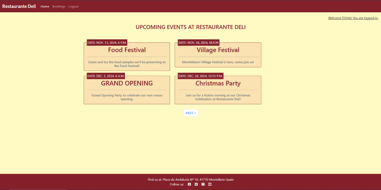

# **DELI RESTAURANT EVENT VIEWER AND BOOKING SYSTEM**

# INTRODUCTION
The Deli Restaurant Event Viewer & Booking System was created for users to be able to see upcoming events, and for the owner to be able to manage and respond to booking requests.

Any events displayed on the site's homepage have been created by the owner of the site, and users who create an account are able to comment on these events. However, any comments displayed would have to be authorised by staff in order to minimise any instances of abuse, inappropriate language, etc.

The site is very simple at the moment, but there are a number of features which will be implemented at a later date. These have been documented in the User Stories.

To view the site please follow the link below:

[Deli Restaurant Site](https://deli-restaurant-d74702301b88.herokuapp.com/)

# CONTENTS

- [OBJECTIVES](#objectives)
  - [Site Owner Goals](#site-owner-goals)
  - [Visitor Goals](#visitor-goals)
     - [First Time Visitors](#first-time-visitors)
     - [Returning Visitors](#returning-visitors)
  - [Project Management](#project-management)
    - [Github Projects](#github-projects)
    - [Models Used](#models-used)

- [USER EXPERIENCE](#user-experience)
  - [User Stories](#user-stories)
  - [Wireframes](#wireframes)
  - [Site Structure](#site-structure)
  - [Design Choices](#design-choices)  

- [FEATURES](#features)
  - [Main Features](#main-features)
    - [Navbar](#navbar)
    - [All Upcoming Events](#all-upcoming-events)
    - [Individual Events](#individual-event)
      - [Event Description](#event-description)
      - [Comment Section](#comment-section)
    - [Bookings](#bookings)
      - [About](#about)
      - [Bookings Section](#bookings-section)
    - [User Profiles](#user-profiles)
      - [Register](#register)
      - [Login](#login)
      - [Log out](#log-out)
      - [Admin Site](#admin-site)
    - [Message Alerts](#message-alerts)
    - [Error Page](#error-page)
  - [Future Features](#future-features)

- [TECHNOLOGIES USED](#technologies-used)

- [TESTING](#testing)
  - [Manual Testing](#manual-testing)
  - [External Testing](#external-testing)
  - [Performance & Accessibility](#performance--accessibility)
  - [Validator Testing](#validator-testing)
  - [Troubleshooting](#troubleshooting)

- [PROJECT DEPLOYMENT](#project-deployment)
  - [Deployment to Heroku](#deployment)  
  - [How to fork the repository from Github](#how-to-fork-the-repository-from-github)
  - [How to clone the project](#how-to-clone-the-project)

- [CREDIT](#credit)
  - [Content Credits](#content-credit)
  - [Media Credts](#media-credits)
  - [Acknowledgements](#acknowledgements)

# OBJECTIVES
The site's aim is to enable visitors to see all the upcoming events at the Deli Restaurant, as well as to submit booking requests.

[Back to top](#contents)

## SITE OWNER GOALS
As the site owner, the main goal of the site is to be able to list events which will be occurring at the venue, filter and review comments submitted on event posts, and manage the booking requests users submit. 

The About section on the bookings page is also editable, and the code ensures that only the latest version of this content is presented to the user.

[Back to top](#contents)

## VISITOR GOALS
The main goals of visitors to the site are to see a list of events hosted at Restaurante Deli and make a booking to the restaurant. 

[Back to top](#contents)

### FIRST TIME VISITORS
First time visitors to the site will see a number of events displayed on the website which have been created by the Admin.

First time users will also see a navbar with a link to the bookings page, and they are able to create an account so they can make bookings and leave comments.

[Back to top](#contents)

### RETURNING VISITORS
Visitors returning to the site will be able to log into their personal account so they can read other users' comments which have been approved by a member of staff, view the status of their own comments, as well as edit or delete these. Once logged in, they will also be able to submit a booking request, which when approved will be shown on the Bookings page.

[Back to top](#contents)

## PROJECT MANAGEMENT

### GITHUB PROJECTS
Github Projects was the platform used to plan and keep track of the project's development.

The Kanban Board was useful keeping track of Acceptance Criteria, and a link to the Project site can be found below:

- [DELI EVENTS & BOOKINGS](https://github.com/users/JoeOrtiz1995/projects/7/views/1)

### MODELS USED

<b>Agenda App</b>

 

<b>Booking App</b>

 

[Back to top](#contents)

# USER EXPERIENCE

## USER STORIES
Google Sheets was used to keep track of the User stories, and these were assigned labels using Github Issues, and following MoSCoW Prioritisation.

- [User Stories](readme/assets/documents/User_stories_helper_doc.pdf)

- [Github Issues](https://github.com/JoeOrtiz1995/Deli-Events-and-Bookings/issues)

[Back to top](#contents)

## WIREFRAMES
The initial wireframes for the site were created using [Balsamiq](https://balsamiq.com/wireframes/).

<b>Balsamiq Wireframes</b>

 

The site didn't end up looking quite like the wireframes were set up, however they still helped visualise a basic layout for the website.

[Back to top](#contents)

## SITE STRUCTURE
The structure of the site is very simple. 

It is split into three main parts:

1. [Events](#all-upcoming-events)
2. [Bookings](#bookings)
3. [Admin Site](#admin-site)

[Back to top](#contents)

## DESIGN CHOICES
The colour scheme used in the design was inspired by the colours of Restaurante Deli, and the [coolors website](https://coolors.co/) was used to create the palette below.

<b>Restaurante Deli Colour Scheme</b>

 

[Back to top](#contents)

# FEATURES

## MAIN FEATURES

### NAVBAR
The Navbar contains links for the user to navigate across the site, and depending if the user is logged in or not the links displayed will vary.

A user who isn't logged in will see on the navbar links to register and to log in, whereas a logged in user will see a link to log out.

[Back to top](#contents)

### ALL UPCOMING EVENTS
When a user visits the site, the first page they will see is a list of upcoming events which the Admin has created.

They will also see a message indicating whether they are logged in or not.

The page is set up so that only 4 events are displayed per page. If there are more, buttons will be displayed underneath so that users can navigate and view all of the events.

They are able to click on any event, and this will take them to that event's page.

[Back to top](#contents)

### INDIVIDUAL EVENT
On this page a user will see a full description of the event they've clicked on. 

Only Admins are able to create, edit and delete events. They also have the ability to approve comments. 

Once a comment is approved it will be visible to all users who visit that event's page regardless if they're logged in or not.

#### EVENT DESCRIPTION
This section contains the event's description below a banner with the event's date and a photo of the restaurant. Each event has its own description and users are encouraged to comment what they think.

#### COMMENT SECTION
The Comment section is below the event's description. 

What users see will depend on their log in status. If they're not logged in they are able to see approved comments, but a message displayed will let them know that only logged in users are able to leave a comment.

Logged in users will also be able to see all the approved comments as well as any unapproved comments they have posted. Users are able to edit and delete any of their comments.

- #### ADDING COMMENTS
Only a logged in user is able to add comments, and a message is displayed to make them aware. 

- #### EDITING COMMENTS
Logged in users are also able to edit their own comments. If they edit an approved comment, this new edited comment would not be automatically approved and would have to be reviewed and approved by an admin first.

- #### DELETING COMMENTS
Logged in users are able to delete their comments. When looking to delete a comment they will be asked to confirm their decision before the deletion is carried. This was done so as to minimise any unintended deletions.

 

[Back to top](#contents)

### BOOKINGS
This page contains the About section and the form for users to submit a booking request.

#### ABOUT
The About photo and content is what users will see when they first visit the bookings page. The picture of the restaurant's interior is displayed at the top of the page, with a brief history of Restaurante Deli beneath it. 

Admins can edit the text through the admin panel, and the page has been set up so that only the most recent updated version is shown.

#### BOOKINGS SECTION
If a user is logged in, they will see a booking form next to any previous booking requests submitted.

- #### SUBMIT A BOOKING
Only users who are logged in can submit booking requests. While the booking is being reviewed they will see a message stating this.

Once the booking request has been approved the message displayed will now confirm this to the user, who will also be able to see the main details in their booking request.

A future feature will be allowing users to edit or cancel any bookings they make.

[Back to top](#contents)

## USER PROFILES
A message displayed to users across all pages lets them know whether they're logged in or not.

### REGISTER
When a user visits the registration page they will be asked for a Username and Password. Once they've created the account they'll be redirected back to the homepage.

There are links to the Login page for users who already have an account.

### LOGIN
If a user has registered previously they will be able to log in using the link on the nav bar, however they can also use the Remember Me feature so they are automatically logged in whenever they visit the site.

### LOG OUT
Once a user has registered and/or logged into their account, they will have a link in the nav bar to log out.

### ADMIN SITE
This site was created with the intention of staff being able to review the content displayed on their site. 

From here they can:
- Add, view, edit and delete events.
- Review comments by submitted by users.
- Approve booking requests.
- Update the About section's content.

This gives them full CRUD capabilities on the site. Some of the fields staff are able to amend have been improved by implementing Summernote, which enables rich-text editing.

[Back to top](#contents)

## MESSAGE ALERTS
Whenever a user submits a request such as leaving or editing a comment, or sending a booking form, a message will appear on the screen to let them know if it has been possible.

<b>User Messages on Booking Form</b>

 

<b>User messages when editing or deleting Comments</b>

 

## ERROR PAGE
A user would only see this page if an incorrect URL is entered. They will see a message on the page and a button to take them back to the home page. The Navbar links also work the same here as they do throughout the site.

[Back to top](#contents)

## FUTURE FEATURES
There are a number of features which unfortunately have not been able to be implemented at this stage such as:

- Providing Users with the ability to edit and delete booking requests.
- Adding a reviews section where users can review the Restaurant.
- Add further testing on existing models and views.
- Users being able to delete their account.

[Back to top](#contents)

# TECHNOLOGIES USED

## LANGUAGES
- [Python](https://en.wikipedia.org/wiki/Python_(programming_language)) - Provides the functionality for the site.
- [HTML5](https://en.wikipedia.org/wiki/HTML) - Provides the content and structure for the website.
- [CSS3](https://en.wikipedia.org/wiki/CSS) - Provides the styling for the website.
- [JavaScript](https://en.wikipedia.org/wiki/JavaScript) - Provides interactive elements of the website

[Back to top](#contents)

## FRAMEWORKS & SOFTWARE
- [Django](https://www.djangoproject.com/) - A model-view-template framework used to create the site.
- [Bootstrap](https://getbootstrap.com/) - A CSS framework that helps building solid, responsive websites.
- [Balsamiq](https://balsamiq.com/) - Used to create the wireframe.
- [Google Sheets](https://docs.google.com/spreadsheets/create) - Used to log the User Stories.
- [Google Docs](https://docs.google.com/) - Used to start planning the project and keeping notes on it.
- [Github](https://github.com/) - Used to host and edit the website.
- [Gitpod](https://www.gitpod.io) used to push changes to the GitHub repository.
- [Heroku](https://en.wikipedia.org/wiki/Heroku) - A cloud platform that the application is deployed to.
- [Lighthouse](https://developer.chrome.com/docs/lighthouse/overview/) - Used to test performance of site.
- [VSCode](https://code.visualstudio.com/) - Used to create and edit the site.
- [Google Chrome DevTools](https://developer.chrome.com/docs/devtools/) - Used to debug and test responsiveness.
- [HTML Validation](https://validator.w3.org/) - Used to validate HTML code
- [CSS Validation](https://jigsaw.w3.org/css-validator/) - Used to validate CSS code
- [PEP8 Validation](http://pep8online.com/) - Used to validate Python code.
- [JSHint Validation](https://jshint.com/) - Used to validate JavaScript code

[Back to top](#contents)

# TESTING

## TESTING USER STORIES
A complete list of the User Stories can be found here: 

- [User Stories Log](readme/assets/documents/User_stories_helper_doc.pdf)

Manual tests were carried out on all the acceptance criteria which was successful in order to move the User Stories to completed.

As mentioned above though, there were some features which were unable to be implemented and as such these User Stories are still considered either "In Progress" or "To do".

- The Homepage will be a list of upcoming events
  - This has been achieved

- A user doesn't have to log in to see events or make a booking.
  - Due to model relationships it was decided that Users should log in in order to book.

- The bookings page is accessible from a link on the navbar.
  - This has been achieved

- The user can click on an event to expand it and see if they'd like to attend.
  - This has been achieved, they can also comment on these.

- Any new event will be displayed on the site's homepage.
  - As long as the event has been approved it will be displayed

- Only Superusers can add events.
  - This has been achieved

- Users can access the bookings page from the homepage.
  - This has been achieved

- Users can fill and submit a form with their booking request.
  - This has been achieved, although it's a shame not having been able to include CRUD functionality on here as well as on comments.

- The form will be accessible only to Superusers.
  - This has been achieved

- A superuser can create an account with their email.
  - This has been achieved

- A superuser can log into their account.
  - This has been achieved

- A superuser can create, edit and delete events.
  - This has been achieved

- A superuser can view booking requests from the admin panel.
  - This has been achieved

- A user can create an account with their email.
    - This has been achieved

- A user can log in once the account has been created.
    - This has been achieved

- A user can see their past and upcoming bookings when logged in.
  - This has not been able to be implemented yet but will be in future.

- A user can edit their upcoming bookings once logged in.
  - This has not been implemented yet.

- A registered user can access their account and see the status of their booking request.
  - This has been achieved.

- Registered users can see previous booking requests
    - This has been achieved

- Registered users can amend any upcoming booking requests
  - This has not been implemented yet.

- A user is notified if a desired slot is not available
  - This has not been implemented yet.

- Users will get a confirmation message stating the booking has been requested
  - This has been achieved

- Only a superuser can access booking requests
  - This has been achieved

- A superuser can approve booking requests
  - This has been achieved

- A superuser can cancel booking requests
  - This has been achieved

- A superuser can filter booking requests on the admin panel.
  - This has been achieved

- A superuser can sort booking requests on the admin panel.
  - This has been achieved

- A superuser can filter events displayed on the homepage from the admin panel.
  - This has been achieved

- A user can see the About section when they go to make a booking.
  - This has been achieved

- Any modification to the About section will be displayed to the user.
  - This has been achieved

- Only Superusers can modify the About section.
  - This has been achieved

- Any change will be displayed when a user next visits.
  - This has been achieved

- A user can create an account with their email.
  - This has been achieved

- A user can log in once the account has been created.
  - This has been achieved

- A user can see their approved and not yet approved comments.
  - This has been achieved

- A user can edit their comments once logged in.
  - This has been achieved

- Users can access the events' comments page from the homepage.
  - This has been achieved

- Users can leave a comment on any event.
  - This has been achieved

[Back to top](#contents)

## CODE VALIDATION
The code was ran on the following validation sites:

- [HTML Validation](https://validator.w3.org/) - Ran and returned no errors

<b>HTML Validator Results</b>

 

- [CSS Validation](https://jigsaw.w3.org/css-validator/) - Ran and returned no errors

- [PEP8 Validation](http://pep8online.com/) - The Views, Admin, Model and Form files were checked using the CI Python Linter.

- [JSHint Validation](https://jshint.com/) - Running the comments.js file returned just one error. There is an undefined variable connected to Bootstrap, however this is not an issue.

[Back to top](#contents)

## PERFORMANCE & ACCESSIBILITY TESTS

## LIGHTHOUSE CHECKS

<b>Lighthouse Results</b>

 

### BROWSER COMPATIBILITY
The application was tested on the following browsers and it ran without any issues:

- Google Chrome

- Microsoft Edge

- Mozilla Firefox

[Back to top](#contents)

## TROUBLESHOOTING & BUGS
- The main issue encountered during building the project was on the 29th October. I had been working on another version ofthe same project, but was unable to connect to my workspace. The only way round I could find was to create a new repository and start again. As a result there are quite a few features which I was unable to implement in time. 

- I have been unable to carry out testing as extensively as I would have liked to on the Project.

- A bug was detected on the 4th November where a User could submit a booking form requesting a past date. This has now been resolved with the help of a Django Validator (MinValueValidator), which checks that the date submitted in the form by users has to be from today onwards. A message will also be displayed to the user should any of the booking forms' fields not be valid. Some helper text was also added to show users what format the date should be entered. I also would have liked to add a calendar widget to the form to improve the user's experience.

- An error which made the booking form not submit was identified on the 2nd November, and this was caused by the IntegerField I originally assigned to the guests parameter. As I had added choices to this field, even though the choices provided were technically numbers, the fact that they were in quotes meant they were being identified as a string instead. Changing this to a CharField resolved the issue.

[Back to top](#contents)

# PROJECT DEPLOYMENT

## DEPLOYMENT TO HEROKU
The full application was deployed using the [Heroku Website](https://heroku.com/).

The steps taken to deploy the application were as follows:

1. Accessed the Heroku website and logged into my account. If you don't have an account you can follow [this link](https://signup.heroku.com/login) to create one.

2. On the dashboard click on "New", and then "Create new app".

3. I chose an app name (deli-events-and-bookings), changed the region to "Europe" and clicked "Create app".

4. Once this is done, navigate over to the "Settings" section and click on "Reveal Config Vars". Enter any config vars required.

5. Go back over to the "Deploy" section and link your GitHub account by clicking on the GitHub button. Sign in to your GitHub account if necessary, and once this is done type the name of the repository you want to deploy and search for it using the Search button. Once you've found it press "Connect". This will link the Heroku app to the code in GitHub.

7. There are two ways of finalising the application's deployment. At the bottom of the "Deploy" section, you will find an "Automatic deploys" and a "Manual deploy" subsection and you'll have to choose which method you'd prefer. The main difference between these options is that the Manual deploy option deploys the application by running the current code, however if any changes are made these will not be reflected until another Manual deploy is actioned. I've added links for further information about both of these options below.

    - [Heroku Automatic Deploys](https://devcenter.heroku.com/articles/github-integration#automatic-deploys)

    - [Heroku Manual Deploys](https://devcenter.heroku.com/articles/github-integration#manual-deploys)

8. On this occasion I chose the Manual deploys option.

9. Once the deployment has finished, a message will appear to confirm this above a button that says "View" which will take you to the deployed application. You can also click on open app at the top of the Page.

[Back to top](#contents)

## HOW TO FORK THE REPOSITORY FROM GITHUB
The steps required to fork [this repository](https://github.com/JoeOrtiz1995/Deli-Events-and-Bookings) are listed below:

1. Follow the link above to locate my original repository.

2. In the code section, there is a button that says "Fork" located just above the "About" section.

3. Click on this button and the fork will be created.

[Back to top](#contents)

## HOW TO CLONE THE PROJECT
To clone this project follow the steps listed below:

1. Navigate over to [this repository](https://github.com/JoeOrtiz1995/Deli-Events-and-Bookings) and click on the green "Code" button located next to "Add file".

2. From the dropdown copy the URL link. This can be done using the copy button next to the link or by highlighting it and copying it.

3. Within the IDE open Git Bash, and change the working directory's location to the one you want to work off, at which point the cloned directory will be created.

4. Type "git clone", and paste the URL copied in step 1 and the clone will be created.

[Back to top](#contents)

# CREDIT

## CONTENT CREDIT
The concept for this project came from my cousin who owns the Deli Restaurant. 

The content was created by myself, however I did rely on the Django Blog Walkthrough to help. 

[Back to top](#contents)

## MEDIA CREDITS
The pictures used come from Google. 

[Back to top](#contents)

## ACKNOWLEDGEMENTS
I would like to mention my Mentor, [Precious Ijege](https://www.linkedin.com/in/precious-ijege-908a00168/) for his support and feedback during the building process. His suggestions and comments on the application and how to improve it helped me have the confidence to go further and test my knowledge.

A further acknowledgement to [Worldofmarcus](https://github.com/worldofmarcus) as their [README.md](https://github.com/worldofmarcus/project-portfolio-4/blob/main/README.md) file was a great tool to help me set out the structure for mine.

I would also like to add a further thank you to the Student Support Team at Code Institute for their assistance so far on the course.

[Back to top](#contents)